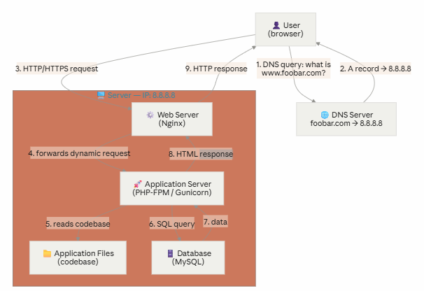
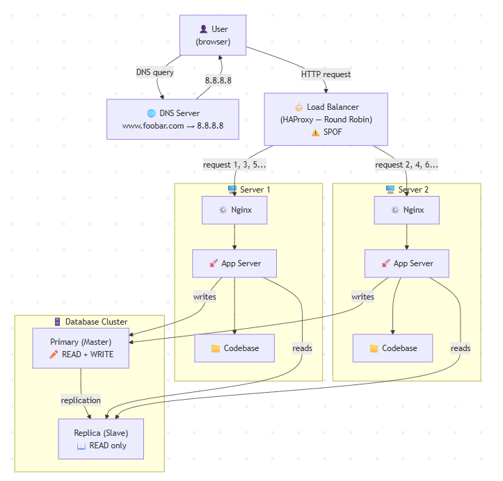
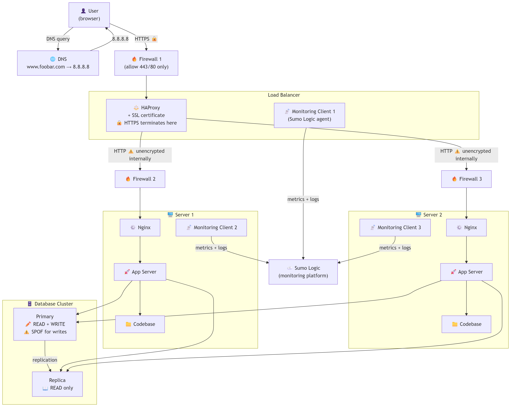
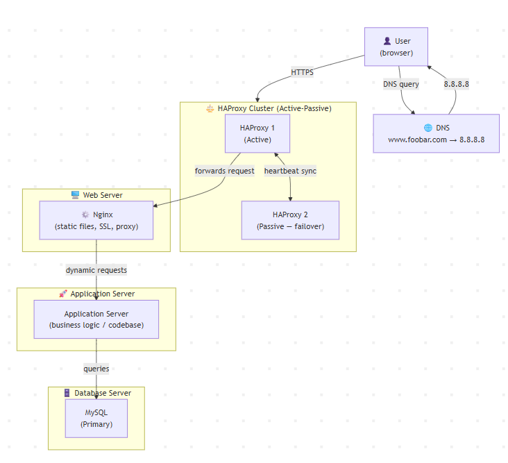

# Web Infrastructure Design

This project covers the progressive design of a web infrastructure hosting
`www.foobar.com`, from a single server to a scaled, secured, and monitored
multi-server architecture.

---

## Task 0 — Simple Web Stack

Design a one-server infrastructure using a LAMP-style stack. The server hosts
Nginx (web server), an application server, the codebase, and a MySQL database.
A DNS A record maps `www.foobar.com` to IP `8.8.8.8`.

Key concepts covered: role of each component, DNS A record, HTTP protocol,
and the three main weaknesses of a single-server setup (SPOF, maintenance
downtime, no scalability).

Diagram: `0-simple_web_stack.png`
Explanation: `0-simple_web_stack`

---

---

## Task 1 — Distributed Web Infrastructure

Design a three-server infrastructure adding a HAProxy load balancer and a
second application server. The database layer uses a Primary-Replica
(Master-Slave) cluster to separate reads from writes.

Key concepts covered: Round Robin load balancing, Active-Active vs
Active-Passive setup, Primary-Replica replication, and the remaining
weaknesses (SPOF on the load balancer, no security, no monitoring).

Diagram: `1-distributed_web_infrastructure.png`
Explanation: `1-distributed_web_infrastructure`

---

---

## Task 2 — Secured and Monitored Web Infrastructure

Builds on Task 1 by adding three firewalls (one per node), an SSL certificate
for HTTPS, and three monitoring agents shipping data to Sumo Logic.

Key concepts covered: firewall rules, end-to-end encryption with TLS, purpose
of monitoring, how agents collect metrics and logs, how to monitor Nginx QPS,
and the remaining issues (SSL termination at the LB, single write node,
mixed-component servers).

Diagram: `2-secured_and_monitored_web_infrastructure.png`
Explanation: `2-secured_and_monitored_web_infrastructure`

---

---

## Task 3 — Scale Up

Separates every component onto its own dedicated server (web server,
application server, database server) and adds a second HAProxy instance
clustered with the first to eliminate the load balancer as a SPOF.

Key concepts covered: separation of concerns, independent scaling per layer,
HAProxy clustering with VRRP/Keepalived for high availability.

Diagram: `3-scale_up.png`
Explanation: `3-scale_up`

---

---